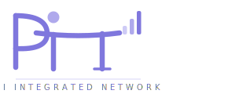

<p align="center">
  
</p>

<h1 align="center">PiN — Pi Integrated Network</h1>

<p align="center"><strong>A free, open, community‑powered web — built by everyone, for everyone.</strong></p>

<p align="center">Are you IN?</p>

---

# What is PiN?

PiN turns everyday devices — Raspberry Pis, laptops, desktops, phones — into a **global mesh network** that can host websites, share files, and deliver content without relying on big tech servers.

If a device can connect to the internet, it can join PiN.

PiN is:

- **Decentralized** — no central servers, no gatekeepers  
- **Open‑source** — anyone can inspect, improve, or build on it  
- **Lightweight** — runs on tiny hardware, scales to powerful machines  
- **Self‑sustaining** — nodes earn **Hashes** for contributing resources  
- **Easy to use** — browse `.pin` sites just like the normal web  

PiN is designed so that **a fifth grader can use it**, and **a senior engineer can extend it**.

---

# Why PiN exists

The web used to be simple: you could host a site from your bedroom.  
Today, hosting requires:

- cloud accounts  
- monthly fees  
- complex dashboards  
- centralized infrastructure  

PiN brings back the original spirit of the internet:

> **A web owned by its users, not corporations.**

Anyone can host.  
Anyone can contribute.  
Anyone can build.

---

# How PiN works (simple version)

Every device that joins PiN runs a tiny program called **meshd**.

meshd lets your device:

- discover nearby nodes  
- store and share content  
- route requests  
- earn Hashes for helping the network  

When someone visits a `.pin` site:

1. Their PiN browser asks the mesh for the content  
2. The mesh finds the closest device that has it  
3. That device serves the content directly  
4. The serving node earns Hashes  

If a node goes offline, the mesh reroutes automatically.

No servers.  
No subscriptions.  
No single point of failure.

---

# What you can do with PiN

PiN supports:

### ✔ Static websites  
HTML, CSS, JS — no backend required.

### ✔ Automation & webhooks  
Trigger scripts, IoT devices, or workflows.

### ✔ File & asset delivery  
A community‑powered CDN.

### ✔ Off‑grid connectivity  
Works over WiFi, Ethernet, cellular, point‑to‑point, and (later) LoRa.

### ✔ Local‑first browsing  
`.pin` domains resolve inside the mesh — no DNS required.

---

# Node tiers

Any device can join. You choose how much you contribute.

| Tier | Device Type | Best For | Hash Rate |
|------|-------------|----------|-----------|
| 1 | Raspberry Pi, always‑on SBC | Static hosting, webhooks, assets | Base |
| 2 | Phone, tablet, laptop | Caching, relaying, light APIs | 2× |
| 3 | Desktop PC, mini PC, NAS | Heavy compute, large storage | 4× |

---

# The Hash incentive

PiN uses **proof‑of‑service** — not mining, not waste.

You earn Hashes for:

- serving traffic  
- staying online  
- storing content  
- contributing resources  

Hashes can be used to:

- boost your hosted content  
- allocate more bandwidth  
- support other creators  
- participate in future ecosystem tools  

---

# Current status

PiN is under active development.

### ✔ Phase 1 — Core daemon (complete)
- meshd daemon  
- DHT routing  
- content‑addressed storage  
- local Hash ledger  
- HTTP API  
- Windows + Linux + Raspberry Pi support  

### ✔ Phase 2 — Resource scheduler (complete)
- CPU, RAM, bandwidth, and schedule controls  
- battery and WiFi rules  
- live config reload  
- cross‑platform support  

### 🔄 Phase 3 — PiN browser (in progress)
- `.pin` domain resolver  
- site publishing  
- browser backend  
- Tauri desktop app (next)  

### ⬜ Phase 4 — Mobile + connectivity
- Android + iOS  
- LoRa + Meshtastic  
- rural/off‑grid support  

---

# Architecture (visual diagram coming soon)

A full architecture diagram will be added here in Step C.

For now, see the full technical specification:

👉 **[docs/SPEC.md](docs/SPEC.md)**

---

# Repository structure

```text
pin-network/
│
├── LICENSE
├── CONTRIBUTING.md
├── README.md
├── docs/
│   ├── SPEC.md
│   └── LAUNCH_POSTS.md
│
└── src/
    ├── meshd/         # Go daemon (core of the network)
    ├── pin-browser/   # Go resolver + browser backend
    └── pin-app/       # Tauri desktop/mobile app
